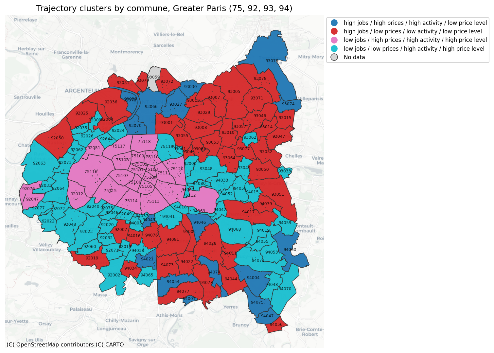
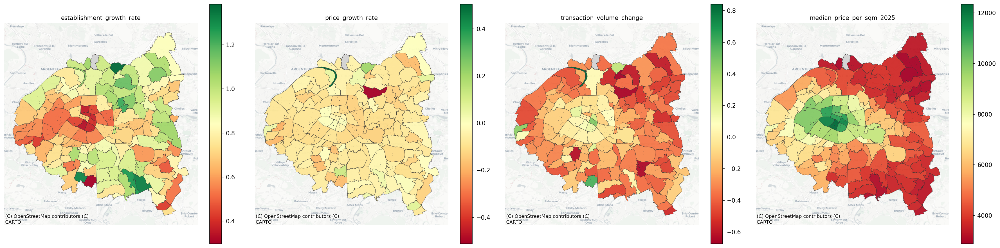

# Results & diagnostics

Full walkthrough of what came out of each notebook, including the raw diagnostics from the most recent run. This is the "show your work" companion to the summary in the main [README](../README.md).

## 1. Trajectory typology (notebook 1)

The map above is the end product: every commune in Paris + Hauts-de-Seine (92) + Seine-Saint-Denis (93) + Val-de-Marne (94) assigned to one of four k-means clusters over a 4-feature panel (establishment growth rate, price growth rate, transaction-volume change, median price per m² in 2025). Reading the four types against their geography:

- **Pink — low job growth / high price growth / high activity / high price level.** Sits almost exactly on central Paris (the 75101–75120 arrondissements). Makes sense: the core is already saturated with jobs, so growth is structurally elsewhere, while it remains the most expensive and most actively traded part of the region.
- **Cyan — low job growth / low price growth / high activity / high price level.** Concentrated in the affluent inner-western suburbs (92) and pockets of the south. Mature, expensive, liquid markets that aren't currently gaining jobs or appreciating quickly — a "stable but not dynamic" profile.
- **Red — high job growth / low price growth / low activity / low price level.** The largest single class, spread across most of Seine-Saint-Denis (93) and parts of Val-de-Marne (94). Job growth without market heat yet — the areas that look most like they're absorbing employment growth while remaining comparatively affordable.
- **Blue — high job growth / high price growth / high activity / low price level.** A smaller set of communes, mostly on the northeastern edge (e.g. around 93074, 93078). This is the "gentrifying / early re-rating" signature: job growth *and* price growth *and* trading activity, but still starting from a low price level — the closest thing in this typology to areas at risk of the affordability erosion the HARMONIC call's vulnerability framing is concerned with.
- **Grey — no data.** One commune (93059) drops out because it isn't covered by the underlying panel — flagged rather than silently interpolated, in line with the proposal's harmonization approach.

**Why this matters for the proposal:** this is a rough, unsupervised version of exactly the "urban offer trajectory" typology described in §2 — territories combining high jobs with low prices (red/blue) versus territories with low job growth but high prices and activity (pink/cyan) fall out of the clustering without any hand-coded rules.

### The raw features behind it

These four panels are the inputs to the clustering above, plotted independently:

- **`establishment_growth_rate`** — the clearest spatial gradient of the four: growth is concentrated in the outer ring (northeast and southeast), while pockets of relative decline appear scattered through the inner suburbs. This is what's driving the red/blue vs. pink/cyan split.
- **`price_growth_rate`** — mostly flat (pale yellow, near zero) across the whole region, *except* for one commune near Argenteuil that saturates the green end of the scale and one that saturates the red end. This is a direct, visual confirmation of the exact risk flagged in the proposal's §4 ("Outlier- and small-sample-driven instability"): one or two extreme communes can visually dominate this feature and pull the clustering toward isolating them rather than describing the broader territory. Worth a robustness check (winsorizing this feature specifically) before trusting the typology further.
- **`transaction_volume_change`** — widespread decline (orange/red) across most of the outer departments, with a cluster of stability or growth (green) concentrated in central-west Paris and neighbouring 92 communes. Reads as a broad 2021–2025 slowdown that hit the periphery harder than the core.
- **`median_price_per_sqm_2025`** — the classic Paris price gradient: highest in the city center and western 92, fading steadily toward the northeastern (93) and southeastern (94) periphery. This is the feature giving the clusters their "price level" axis and is the most stable/expected of the four.

## 2. Business-birth forecasting (notebook 2)

### Data coverage check

Before fitting anything, the notebook validates panel coverage against BPE 2025:

| Check | Value |
|---|---|
| Panel communes | 144 |
| BPE 2025 communes | 142 |
| Panel communes not in BPE | 2 |
| Overlap communes | 142 |
| Missing required values in overlap | 0 |

The two dropped communes are **75056** and **93059** — note **93059 is the same commune that showed up as "No data" (grey)** in the typology map above. That's a useful cross-check between the two notebooks: the same commune is genuinely missing from the underlying source data, not a bug specific to one pipeline.

### Model comparison (holdout: 2025 business births)

| Model | MAE | RMSE | R² | Training rows | Boosting rounds |
|---|---:|---:|---:|---:|---:|
| **Persistence (naive baseline)** | **214.78** | 1237.76 | 0.853 | – | – |
| Business-history-only (2016), linear | 453.77 | 914.56 | 0.9197 | 142 | – |
| Business-history-only (2016), + residual boosting | 444.70 | 913.87 | 0.9198 | 142 | 28 |
| Business-history (2016–2021), linear | 284.21 | 1108.37 | 0.8820 | 284 | – |
| Business-history (2016–2021), + residual boosting | 287.10 | 1112.51 | 0.8812 | 284 | 9 |

Three things worth pulling out of this table, all directly relevant to the proposal's "AI vs. structural baseline" question:

1. **No model wins outright — it depends what you optimize for.** Persistence has the best (lowest) MAE by a wide margin, meaning it's typically the closest guess for a typical commune. But it has by far the worst RMSE and R², meaning it gets badly burned on a handful of high-activity communes. The ML models trade the reverse: worse typical-case error, but a much better overall fit because they don't blow up on the extreme communes. That's a genuine, reportable nuance rather than a clean "AI wins" or "AI loses" story.
2. **More training history helps MAE but hurts RMSE/R².** Adding the 2019→2021 period (doubling training rows from 142 to 284) drops MAE from ~444–454 down to ~284–287 — closer to persistence — but *raises* RMSE back up toward persistence's level and lowers R² from ~0.92 to ~0.88. More data made the typical case better and the tail case worse. This is exactly the "more data and complexity don't automatically produce better forecasts" caution from the proposal, just visible in a more specific, two-directional form than a flat "didn't help."
3. **The residual-boosting step adds almost nothing on top of the linear component**, and in the 2016–2021 case it's marginally *worse* on every metric than the linear model alone (287.10 vs. 284.21 MAE; 1112.51 vs. 1108.37 RMSE). Early stopping after just 9 boosting rounds (vs. 28 in the smaller 2016-only run) suggests there's very little residual signal left for gradient boosting to pick up once the linear trend is fit — the structural component is doing essentially all of the work.

### Where the model misses hardest

| Commune | Actual births (2025) | XGBoost prediction | Signed error | Absolute error |
|---|---:|---:|---:|---:|
| 75108 | 34,529 | 22,158.9 | −12,370.1 | 12,370.1 |
| 75115 | 10,934 | 7,774.8 | −3,159.2 | 3,159.2 |
| 75101 | 3,379 | 5,121.0 | +1,742.0 | 1,742.0 |

The two worst misses (75108, 75115) are both large underestimates on the highest-volume central-Paris arrondissements — the model systematically undershoots at the very top of the activity distribution, which is consistent with the RMSE/R² story above: a small number of very large communes carry a disproportionate share of the error.

### BPE (amenity) features: excluded, and why

A prior ablation test found BPE equipment/domain features (facility and amenity inventories) had **near-zero standalone R²**, and when combined with business-history features, the residual XGBoost step **stopped after ~2 boosting rounds** — i.e. almost nothing left to learn once history was already in the model. Both features were dropped from this model on that basis rather than kept for appearances. This is a concrete, negative finding worth carrying into the thesis: amenity-inventory data, at least in this form, doesn't obviously help predict *where new businesses form* once you already know the recent history of business formation there — job/business dynamics here look more autoregressive than amenity-driven.
